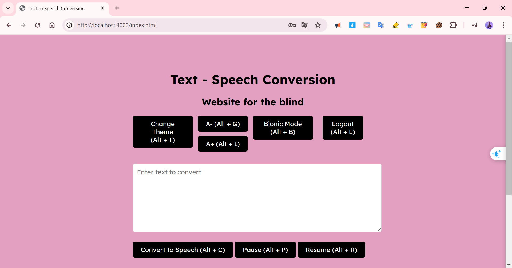
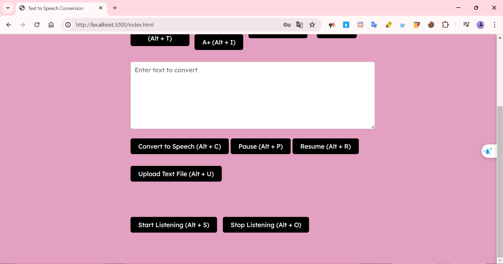
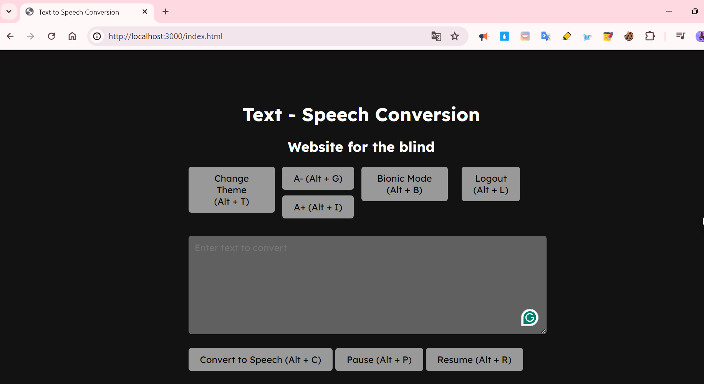
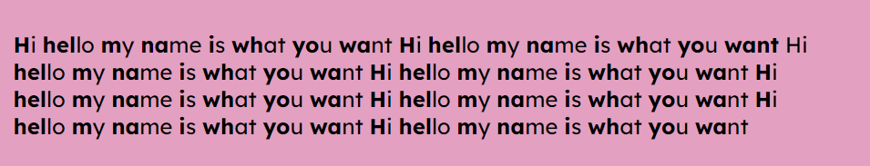
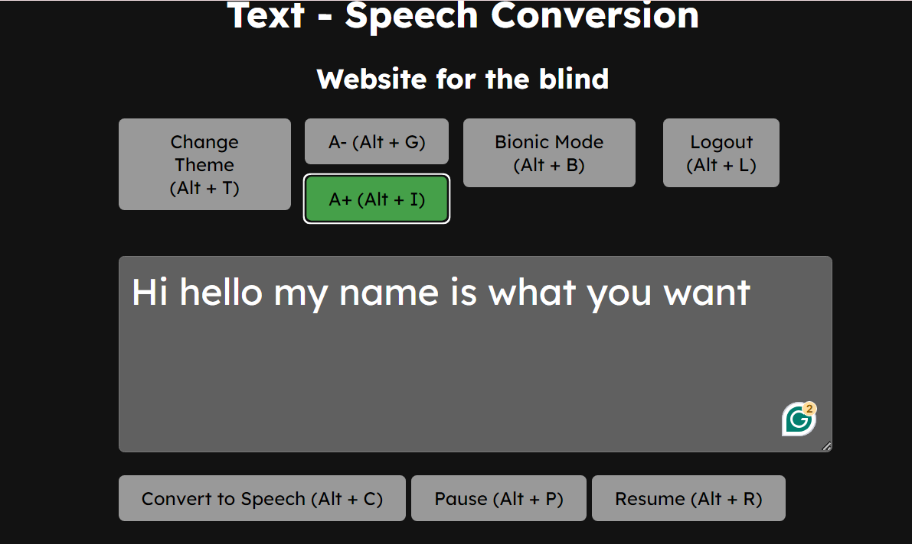
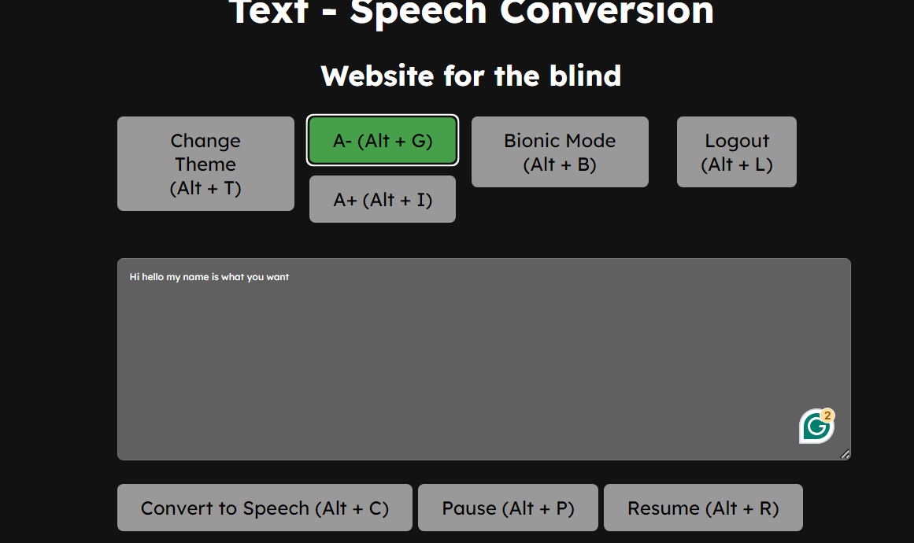
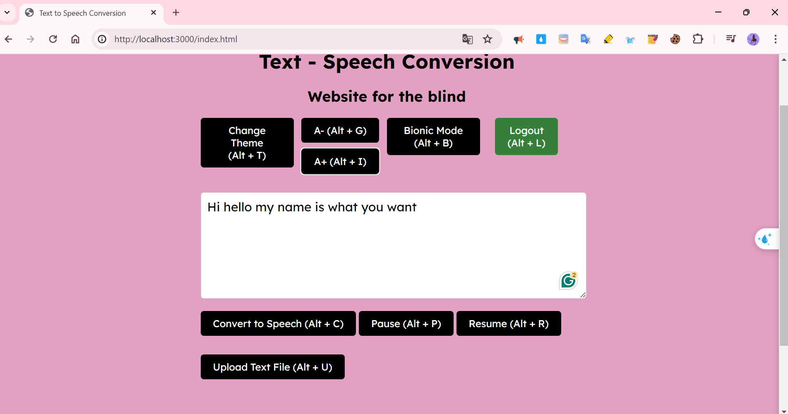

# Text to Speech Conversion 

Trang web dành cho người khiếm thị

## Cách cài đặt

Cài đặt các gói SQLite, multer và speech-to-text

    npm install express body-parser sqlite3

    npm install multer @google-cloud/speech
1. Chạy lệnh `node server.js` để khởi động máy chủ.

2. Truy cập http://localhost:3000/register.html để đăng ký tài khoản.

3. Sau khi đăng ký chuyển đến trang đăng nhập.

4. Đăng nhập với thông tin tài khoản vừa tạo sẽ chuyển đến trang chính.

!

## Các phím tắt được sử dụng 

`Alt + T`: Change Theme

`Alt + G`: Decrease Font Size

`Alt + I`: Increase Font Size

`Alt + B`: Bionic Mode

`Alt + C`: Convert to Speech

`Alt + P`: Pause

`Alt + R`: Resume

`Alt + U`: Upload Text File

`Alt + A`: Upload Audio File

`Alt + S`: Start Listening

`Alt + O`: Stop Listening

`Alt + L`: Logout

# Features Demo 
## Đăng ký và đăng nhập

## Chuyển đổi văn bản thành giọng nói

## Chuyển đổi giọng nói thành văn bản
1. Nhấn `Start Listening` hoặc (Alt + S) để bắt đầu nghe
2. Nhấn `Stop Listening` hoặc (Alt + O) để dừng nghe
    
Âm thanh nghe được sẽ được chuyển thành văn bản trên ô text

## Dừng nghe và tiếp tục nghe
1. Nhấn `Pause` hoặc (Alt + P) để tạm dừng nghe
2. Nhấn `Resume` hoặc (Alt + R) để tiếp tục nghe
    

## Nghe văn bản nhập từ file .txt và upload file pdf

Sau khi nhấn `Upload Text File` hoặc (Alt + U) văn bản của file .txt, pdf sẽ được hiển thị trong hộp text

## Tóm tắt văn bản được viết/upload lên
1. Điền hoặc upload văn bản vào hộp text.
2. Nhấn `Summarize` hoặc (Alt + M) để tóm tắt văn bản

## Thay đổi giao diện sáng tối

Nhấn `Change Theme` hoặc (Alt + T) để thay đổi giao diện
- Sáng 

- Tối

## Bật Bionic Mode

## Tăng giảm cỡ chữ
- Tăng cỡ chữ (A+)

- Giảm cỡ chữ (A-)

## Logout
- Sau khi đăng xuất, hệ thống chuyển đến trang đăng nhập ban đầu
