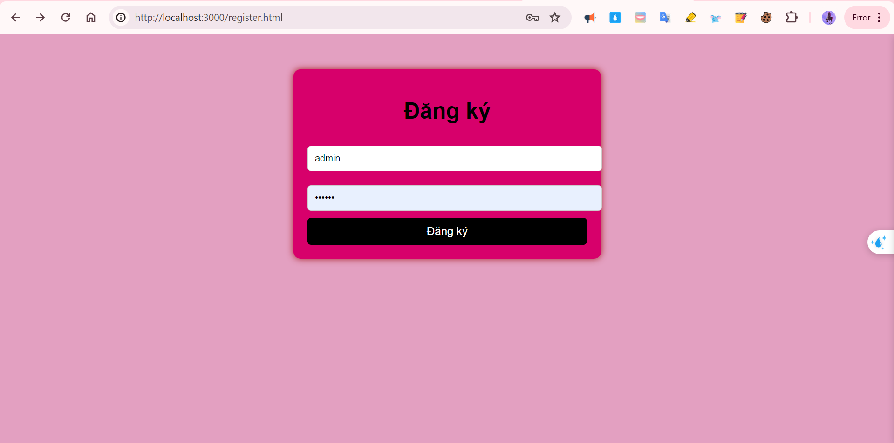
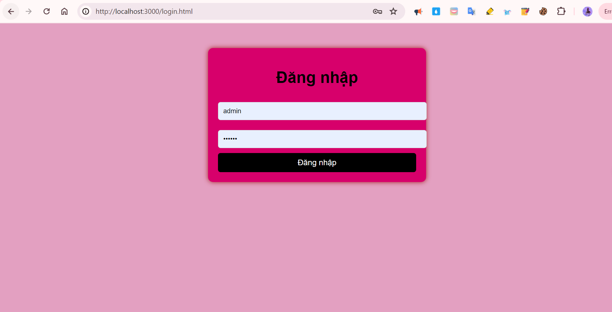
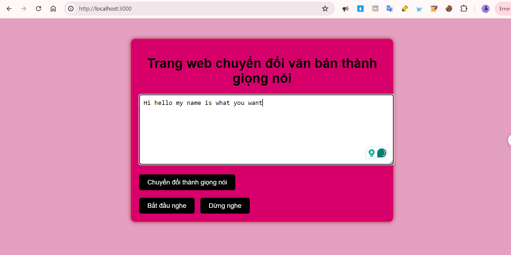

1. Chạy lệnh node server.js để khởi động máy chủ.
2. Truy cập http://localhost:3000/register.html để đăng ký tài khoản.
3. Sau khi đăng ký chuyển đến trang đăng nhập.
4. Đăng nhập với thông tin tài khoản vừa tạo sẽ chuyển đến trang chính.

